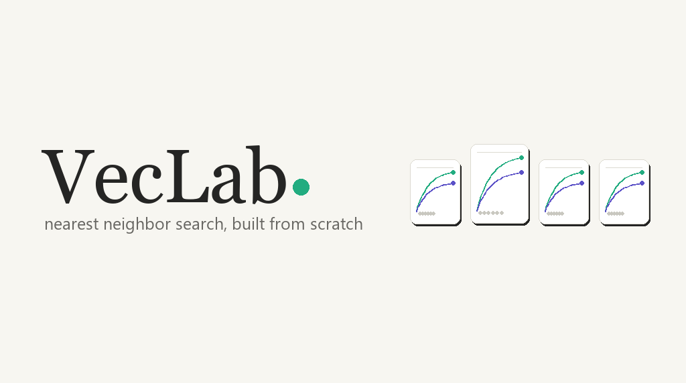
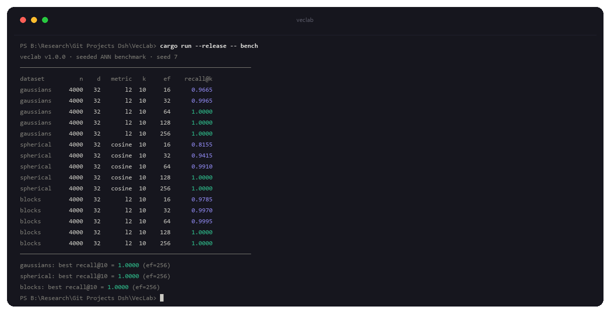
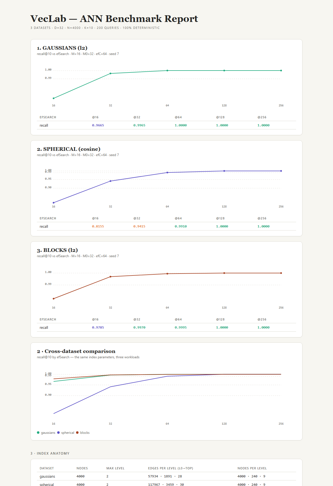
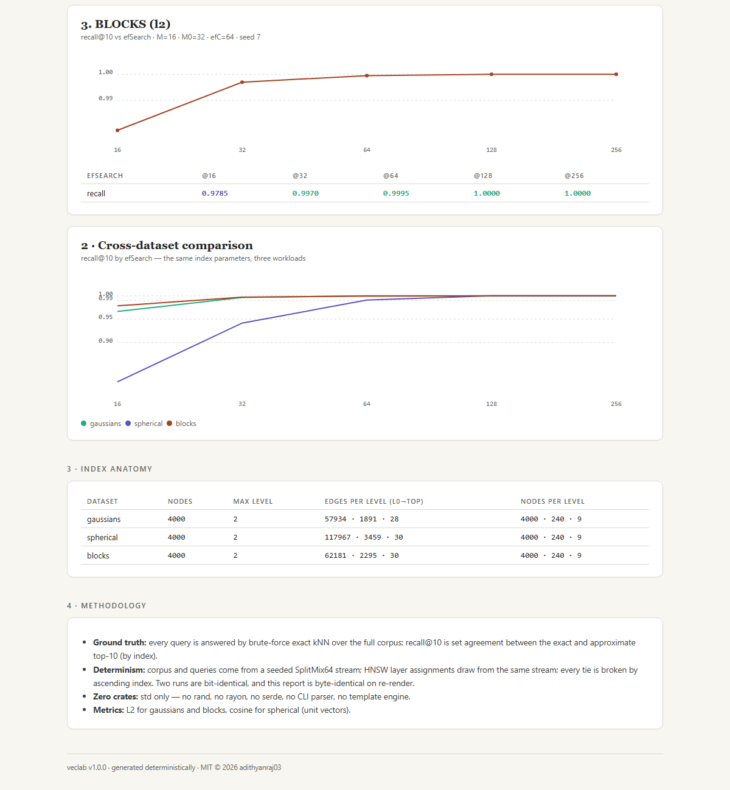

<p align="center">
  
</p>

<h3 align="center">VecLab — HNSW nearest neighbor search, built from scratch</h3>

<p align="center">
  
  
  
  
  
</p>

<p align="center">
  <b>Vector search is where RAG pipelines actually die — and the index is a black box.</b><br>
  HNSW rebuilt from scratch in Rust — the multi-layer graph, the beam search, the
  diversity heuristic — measured against brute-force exact kNN on a seeded corpus.
  No faiss, no hnswlib, no rand.
</p>

---

## What this is

The approximate nearest neighbor (ANN) problem: given a corpus of vectors and a
query, return the k closest vectors — fast. Every serious implementation is a
graph: you trade a bit of recall for orders of magnitude fewer distance
computations. This repo builds that graph, and the measurement harness around
it, one module per piece:

- **`hnsw`** — HNSW (Hierarchical Navigable Small World, Malkov & Yashunin 2016): multi-layer proximity graph, greedy top-down descent, per-layer beam search, and the paper's rule-1 neighbor selection that keeps neighborhoods diverse instead of cliquish
- **`exact`** — brute-force kNN: the ground truth every approximate answer is measured against, with ties broken by ascending index so the truth itself is deterministic
- **`vector`** — L2 and cosine distance in plain `f32`
- **`rng`** — SplitMix64 (known-answer tested against an independent reference) plus Box-Muller Gaussians, one seeded stream per run
- **`bench`** — three seeded dataset families and the recall@k sweep harness
- **`report`** — a single-file HTML report, byte-identical on re-render

Every recall number in this repo is a ratio of two fully deterministic things:
the graph search's top-k and the brute-force top-k over the same seeded corpus.

## The index

Each node is assigned a level by drawing `floor(-ln(u) · 1/ln(M))` from the
seeded stream — about 1 in M nodes reaches level 1, 1 in M² reaches level 2,
and so on. High layers are sparse expressways; layer 0 holds the full graph.

- **Insert** — descend greedily from the entry point to the node's level, then
  run an `efConstruction`-wide beam search on every layer the node occupies.
  Edges are wired bidirectionally, and each overflow is resolved by the rule-1
  heuristic: a candidate is kept only if it is closer to the new node than to
  *every* already-accepted neighbor (not in any accepted neighbor's shadow).
  That single filter is what turns a bag of cliques into a navigable graph.
- **Query** — the same descent, then an `ef`-wide beam search on layer 0.
  Higher `ef` explores more candidates: better recall, more distance
  computations. The whole recall/quality trade-off is visible in one sweep.

## The benchmark

Three seeded workloads, 4000 vectors of 32 dims each, k = 10, 200 in-distribution
queries, one shared index configuration (M = 16, M0 = 32, efConstruction = 64,
seed 7):

- **`gaussians`** — 12 Gaussian clusters on a lattice, L2. The classic ANN workload.
- **`spherical`** — uniform points on the 31-sphere, cosine. The hardest geometry: no clusters to anchor to, only angular structure.
- **`blocks`** — 20 shared 16-dim block codes with 0.1σ noise on the rest: a near-duplicate-heavy workload, the way real embedding stores get messy.

```
$ cargo run --release -- bench
dataset          n    d   metric   k     ef    recall@k
gaussians     4000   32       l2  10     16      0.9665
gaussians     4000   32       l2  10     64      1.0000
spherical     4000   32   cosine  10     16      0.8155
spherical     4000   32   cosine  10     64      0.9910
blocks        4000   32       l2  10     64      0.9995
```

<p align="center">
  
</p>

Read those curves:

- **Spherical is the honest difficulty** — recall climbs 0.82 → 0.94 → 0.99 →
  1.00 as ef grows, because on a uniform sphere the beam has no cluster to
  home in on and has to earn every hop. It needs ef = 128 for perfect recall
  where gaussians is done at 64.
- **Blocks saturates fastest** — near-duplicate structure makes the graph
  deceptively easy to navigate; the 0.98 at ef = 16 is real, not a bug.
- **Every workload reaches 1.0000** at ef = 256: the graph is good enough that
  the remaining budget is the measurement, not the method. If a workload
  can't be driven to perfect recall here, you can see exactly where it bends.

## Quickstart

```bash
cargo build --release

# the seeded recall benchmark (3 datasets, 5 ef values each)
cargo run --release -- bench

# the same run rendered as a single-file HTML report
cargo run --release -- report --out report.html

# a tiny fast run
cargo run --release -- demo

# the test suite
cargo test
```

Useful flags: `-d/--dataset <gaussians|spherical|blocks|all>`, `-n/--n`,
`--dim`, `--k`, `--m`, `--efc`, `--ef-sweep 16,32,64,128,256`, `--seed`,
`--queries`, `-o/--out`. Defaults are fixed, so every run is reproducible.

### Using it as a library

```rust
use veclab::bench::{make_corpus, make_queries, Dataset};
use veclab::hnsw::{build, HnswParams};
use veclab::vector::Metric;

let corpus = make_corpus(Dataset::Gaussians, 4000, 32, 7);
let idx = build(
    &corpus,
    &HnswParams {
        m: 16,
        m0: 32,
        ef_construction: 64,
        metric: Metric::L2,
        seed: 7,
    },
);

let q = make_queries(Dataset::Gaussians, 1, 32, 7)[0].clone();
let top10 = idx.search(&q, 10, 64);
// top10: [(index, distance), ...] sorted nearest-first
```

## Why it's built this way

- **Ground truth by construction.** The exact kNN oracle is O(n·d) brute force
  over the same seeded corpus the graph was built from — no external dataset,
  no network, no "the benchmark data is stale" failure mode.
- **Determinism is the contract, not a side effect.** No `HashMap` anywhere
  (`BTreeSet` + `Vec` throughout), one seeded SplitMix64 stream, every tie
  broken by ascending index. Identical corpus + parameters + seed ⇒
  bit-identical graph, identical results, byte-identical report. The test
  suite asserts this.
- **Honest workloads, not one flattering number.** The report carries a curve
  per dataset: a benchmark that only shows the best row is marketing.
- **The oracle is a citizen.** Exact kNN is a first-class module with its own
  tests and tie-breaking, not a throwaway in the benchmark script.

## The report

`veclab report --out report.html` renders a single-file document:

- **Per-dataset cards** — the recall@k-vs-ef curve with the exact value table
- **Cross-dataset comparison** — all three curves overlaid under one index config
- **Index anatomy** — max level, directed edges per level, node counts per level
- **Methodology** — ground truth, determinism, zero-crate, and metric notes

<p align="center">
  
</p>

<p align="center">
  
</p>

<p align="center"><sub><b>Sample report</b> — rendered from the standard 3-dataset sweep via <code>veclab report --out report.html</code>.</sub></p>

No external assets, no script tags, prints clean, byte-identical on re-run.

## Tests

90 offline tests, no network, no GPU:

- **rng** — SplitMix64 known-answer tests against independently computed reference values, uniform ranges, Gaussian mean/std over 100k samples, rejection-sampling coverage and uniformity
- **vector** — L2/cosine identities, the zero-vector guard, metric bounds, parse aliases, triangle inequality
- **exact** — hand-computed kNN orderings, the equidistant tie-break, k/empty edge cases, recall fractions
- **hnsw** — graph invariants (no self-loops, degree caps at M/M0, index bounds, level structure), build and search determinism across independent builds, one-by-one insert ≡ batch build, recall thresholds at ef = 64, recall monotone in ef, the top-level insertion regression
- **bench** — dataset structure (unit sphere, block codes, bounded coordinates), config defaults, run determinism, the standard suite
- **report** — document structure, every reported number present verbatim, byte-identical re-render

```bash
cargo test
```

## Design notes

- **The diversity heuristic is the difference between 0.72 and 1.00.** The
  first build selected each node's neighbors as "the M closest candidates" —
  and recall capped at ~0.73 on gaussians at any ef. Closest-only selection
  makes cliques: the graph becomes dense inside neighborhoods and sparse
  between them, so the beam gets trapped. Switching insertion to the paper's
  rule-1 shadow filter (keep a candidate only if no accepted neighbor is
  closer to it) raised the same configuration to 1.0000 with no other change.
  Degrees now vary by design; that's the heuristic working, not a bug.
- **No `HashMap`, no threads.** The graph is a pure function of
  (corpus, params, seed) because every collection is order-stable.
- **`f32` throughout, tail-clamped.** The Gaussian generator clamps at ±8σ
  (density < 10⁻¹⁵), so every coordinate is bounded and no corpus can carry
  a `NaN` into the distance arithmetic.
- **`std` only.** No `rand`, no `rayon`, no `serde`, no CLI parser, no
  template engine — the entire project is one crate and its tests.

## Roadmap

- Product/similarity quantization (PQ, SQ8) measured by the same exact-recall harness
- A deterministic binary serialization of the graph, plus incremental insert
- A throughput mode (wall-clock QPS with an explicit variance protocol) — deliberately absent from the results today, which are pure arithmetic
- Real embedding corpora (SIFT-1M-style) behind a flag, still fully offline

---

`© 2026 Adithya N Raj`
